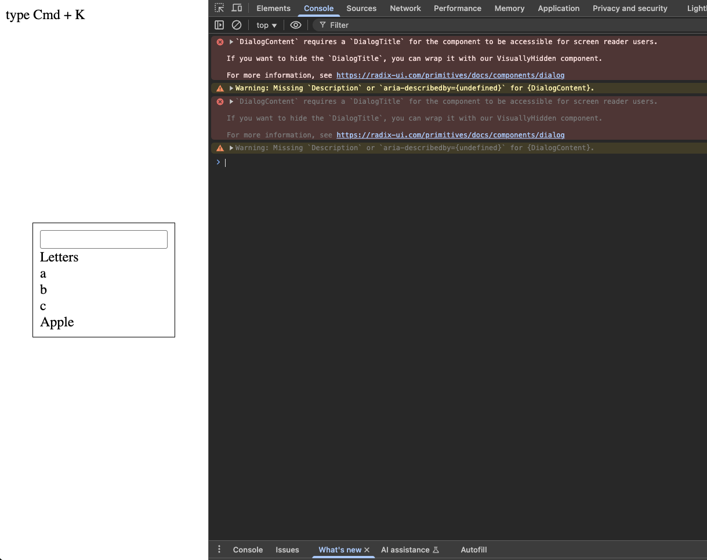
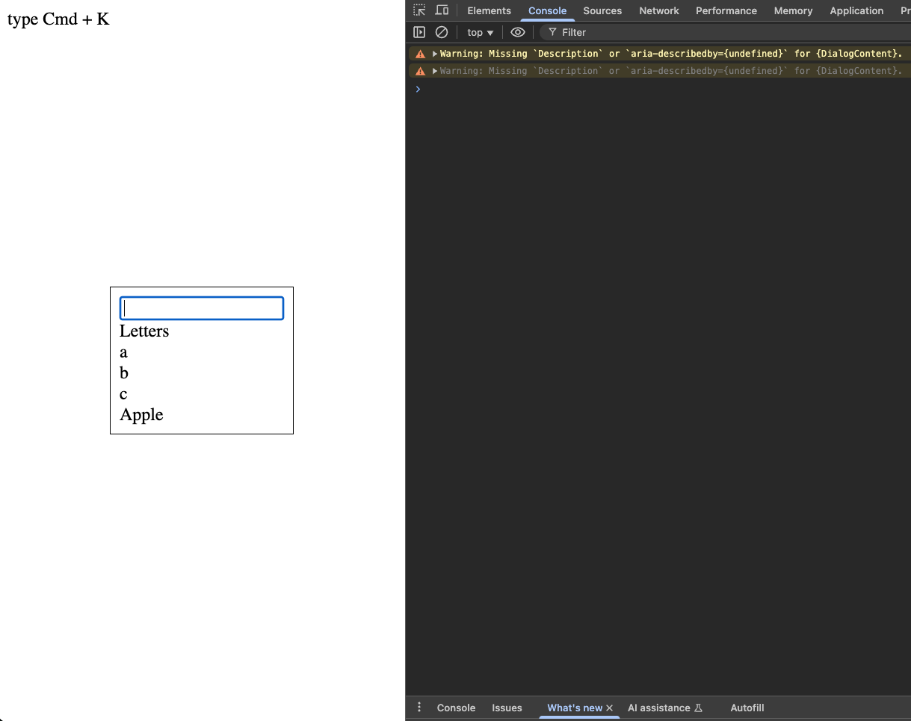

reproduction of https://github.com/pacocoursey/cmdk/pull/360

# run

## prepare

1. `git clone https://github.com/tnyo43/cmdk.git && git clone tnyo43/cmdk-fix-no-title-error-reproduce.git`

## try latest main behaviour

1. `cd cmdk && git checkout main && pnpm install && pnpm run build`
1. `cd ../cmdk-fix-no-title-error-reproduce && pnpm install && pnpm run dev` and [visit page](http://localhost:5173)
1. type Cmd + K and see console.log

## try latest fixed behaviour

1. `cd cmdk && git checkout fix/no-title-error && pnpm install && pnpm run build`
1. `cd ../cmdk-fix-no-title-error-reproduce && pnpm install && pnpm run dev` and [visit page](http://localhost:5173)
1. type Cmd + K and see console.log

## result

| main branch                              | fix/no-title-error branch                                            |
| ---------------------------------------- | -------------------------------------------------------------------- |
|  |  |
